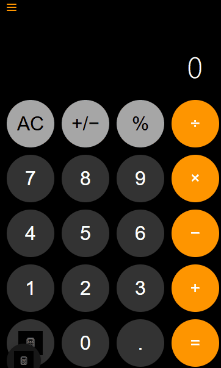

# Calculadora iOS Culichi 🧮



> Una sofisticada aplicación web de calculadora inspirada en iOS con múltiples modos de cálculo y funciones avanzadas.

## ✨ Características

### 🔢 **Tres Modos de Cálculo**
- **Modo Básico**: Operaciones aritméticas estándar para cálculos cotidianos
- **Modo Científico**: Funciones matemáticas avanzadas para cálculos complejos  
- **Modo Conversión**: Conversiones de unidades para aplicaciones prácticas

### 🧮 **Operaciones Básicas**
- ➕ **Suma, Resta, Multiplicación, División** - Todas las operaciones aritméticas estándar
- 🔢 **Soporte de Punto Decimal** - Maneja números de punto flotante con precisión
- ➕➖ **Alternar Más/Menos** - Cambia rápidamente entre números positivos y negativos
- 📊 **Cálculos de Porcentaje** - Convierte números a porcentajes instantáneamente
- ↩️ **Función Retroceso** - Borra dígitos individuales para corrección fácil

### 🔬 **Funciones Científicas**
- 📐 **Funciones Trigonométricas**: `sin`, `cos`, `tan` (entrada en grados)
- 📈 **Funciones Logarítmicas**: `log` (base 10), `ln` (logaritmo natural)
- √ **Funciones de Raíz**: Raíz cuadrada (`√`) y funciones de potencia (`x²`)
- 🔢 **Constantes Matemáticas**: π (Pi) y e (número de Euler)

### 🔄 **Conversiones de Unidades**
- 🌡️ **Temperatura**: Celsius a Fahrenheit (`°C→°F`)
- 📏 **Distancia**: Kilómetros a Millas (`km→mi`), Metros a Pies (`m→ft`)
- ⚖️ **Peso**: Kilogramos a Libras (`kg→lb`)

### 💾 **Historial y Memoria**
- 📋 **Historial de Cálculos** - Almacenamiento automático de todos los cálculos
- ✏️ **Editar Cálculos Anteriores** - Recarga el último cálculo para edición
- 🗑️ **Limpiar Historial** - Elimina todos los cálculos almacenados con confirmación
- 📅 **Filtrado por Tiempo** - Ve cálculos de los últimos 7 días o 30 días

### ⌨️ **Soporte de Teclado**
Soporte completo de navegación e entrada por teclado:
- **Números**: `0-9` para entrada de dígitos
- **Operaciones**: `+`, `-`, `*`, `/` para operaciones matemáticas
- **Funciones**: `Enter` o `=` para igual, `Escape` para limpiar, `Backspace` para borrar
- **Especiales**: `.` para punto decimal, `%` para porcentaje

### 🎨 **UI/UX Moderna**
- 📱 **Diseño Inspirado en iOS** - Interfaz familiar de calculadora con estética moderna
- 🌑 **Tema Oscuro** - Suave para los ojos con alto contraste para visibilidad
- 🟠 **Colores Naranjas de Acento** - Botones de operador distintivos siguiendo el diseño iOS
- ↗️ **Animaciones Suaves** - Transiciones fluidas y retroalimentación responsiva
- 📲 **Diseño Responsivo** - Se adapta a diferentes tamaños de pantalla y dispositivos
- ♿ **Accesibilidad** - Etiquetas ARIA apropiadas y navegación por teclado

## 🚀 Inicio Rápido

### Instalación
1. **Clonar el repositorio**:
   ```bash
   git clone https://github.com/ByCulichi/Calculator-Culichi.git
   cd Calculator-Culichi
   ```

2. **Abrir en navegador**:
   - Simplemente abre `index.html` en cualquier navegador web moderno
   - O usa un servidor local para rendimiento óptimo:
   ```bash
   # Usando Python
   python -m http.server 8000
   # Luego visita http://localhost:8000
   
   # Usando Node.js
   npx serve
   
   # Usando PHP
   php -S localhost:8000
   ```

### Uso

1. **Cálculos Básicos**: Usa el teclado numérico y botones de operadores para matemáticas estándar
2. **Cambio de Modo**: Toca el selector de modo en la parte inferior para cambiar entre modos Básico, Científico y Conversión
3. **Acceso al Historial**: Haz clic en el menú hamburguesa (☰) en la parte superior izquierda para ver el historial de cálculos
4. **Entrada por Teclado**: Usa tu teclado físico para entrada más rápida
5. **Conversión de Unidades**: Cambia al modo Conversión e ingresa un valor, luego toca el botón de conversión

## 🎯 Atajos de Teclado

| Tecla | Función |
|-------|---------|
| `0-9` | Entrada numérica |
| `+` | Suma |
| `-` | Resta |
| `*` | Multiplicación |
| `/` | División |
| `=` o `Enter` | Calcular resultado |
| `Escape` | Limpiar (AC) |
| `Backspace` | Borrar último dígito |
| `.` | Punto decimal |
| `%` | Porcentaje |

## 🛠️ Especificaciones Técnicas

### Tecnologías Utilizadas
- **HTML5**: Marcado semántico con características de accesibilidad
- **CSS3**: Estilos modernos con propiedades personalizadas (variables CSS), diseño Grid y animaciones
- **JavaScript Vanilla**: JavaScript puro (ES6+) sin dependencias externas

### Compatibilidad de Navegadores
- ✅ **Chrome/Edge**: 88+ (Soporte completo)
- ✅ **Firefox**: 78+ (Soporte completo) 
- ✅ **Safari**: 14+ (Soporte completo)
- ✅ **Navegadores Móviles**: iOS Safari 14+, Chrome Mobile 88+

### Características de Rendimiento
- 🚀 **Cero Dependencias** - Sin librerías externas, carga instantáneamente
- 💾 **Almacenamiento Local** - Historial persistido en almacenamiento del navegador
- ⚡ **Ligero** - Tamaño total < 50KB para todos los assets
- 📱 **Listo para PWA** - Puede instalarse como aplicación móvil

## 📁 Estructura del Proyecto

```
Calculator-Culichi/
├── index.html          # Estructura HTML principal con comentarios completos
├── style.css           # Estilos completos con variables CSS y diseño responsivo
├── script.js           # Lógica de la calculadora con documentación JSDoc detallada  
├── iconoCalaculadora.jpg # Icono de la calculadora para branding
├── Animation.gif       # Animación demo para README
└── README.md          # Este archivo de documentación
```

## 🔧 Arquitectura del Código

### Módulos JavaScript
- **Gestión de Estado Global**: `buffer`, `runningTotal`, `previousOperator`, `calculatorHistory`
- **Funciones Principales**: Lógica de cálculo, actualizaciones de pantalla, manejo de operaciones
- **Controladores UI**: Gestión de barra lateral, cambio de modo, operaciones de historial
- **Manejadores de Eventos**: Clics de botones, entrada de teclado, gestión de pantalla splash
- **Funciones de Utilidad**: Visualización de mensajes, validación, conversión de formato

### Organización CSS  
- **Propiedades Personalizadas CSS**: Gestión centralizada de temas y colores
- **Estilos de Componentes**: Estilos modulares para calculadora, barra lateral, botones
- **Diseño Responsivo**: Enfoque mobile-first con diseños flexibles
- **Animaciones**: Transiciones suaves y efectos hover

## 🤝 Contribuir

¡Las contribuciones son bienvenidas! Por favor, siéntete libre de enviar un Pull Request. Para cambios importantes:

1. Haz fork del repositorio
2. Crea una rama de característica (`git checkout -b feature/CaracteristicaIncreible`)
3. Haz commit de tus cambios (`git commit -m 'Añadir alguna CaracteristicaIncreible'`)
4. Haz push a la rama (`git push origin feature/CaracteristicaIncreible`)
5. Abre un Pull Request

### 🐛 Reportar Problemas
Si encuentras un error o tienes una sugerencia:
1. Revisa si ya existe un issue similar
2. Crea un nuevo issue con descripción detallada
3. Incluye pasos para reproducir el problema
4. Añade capturas de pantalla si es relevante

### 💡 Solicitar Funcionalidades
Para proponer nuevas funcionalidades:
1. Explica el caso de uso
2. Describe la funcionalidad propuesta
3. Considera el impacto en la experiencia del usuario

## 📊 Funcionalidades Detalladas

### Modo Científico
- **Funciones Trigonométricas**: Cálculos precisos de seno, coseno y tangente
- **Logaritmos**: Base 10 y logaritmo natural con alta precisión
- **Potencias y Raíces**: Cálculo de cuadrados y raíces cuadradas
- **Constantes**: Valores precisos de π y e para cálculos avanzados

### Sistema de Historial
- **Persistencia**: Los cálculos se guardan automáticamente en localStorage
- **Filtros Temporales**: Visualiza cálculos por períodos específicos
- **Edición**: Reutiliza cálculos anteriores para nuevas operaciones
- **Gestión**: Limpieza selectiva o completa del historial

### Conversiones de Unidades
- **Temperatura**: Conversión precisa °C a °F con fórmula estándar
- **Distancia**: Conversiones métricas/imperiales (km↔mi, m↔ft)  
- **Peso**: Conversión kg↔lb con factores de conversión exactos
- **Interfaz Intuitiva**: Botones dedicados con mensajes informativos

## 🔍 Detalles de Implementación

### Gestión del Estado
```javascript
// Variables globales para el estado de la calculadora
let buffer = "0";           // Número actual en pantalla
let runningTotal = 0;       // Total acumulado
let previousOperator = null; // Último operador usado
let calculatorHistory = []; // Historial de operaciones
```

### Funciones Principales
- **`handleSymbol()`**: Procesador central de entrada
- **`updateScreen()`**: Actualización de la interfaz
- **`processOperator()`**: Manejo de operaciones matemáticas
- **`toggleSidebar()`**: Control del menú de historial

### Eventos y Interactividad
- Soporte completo de teclado físico
- Gestos touch para dispositivos móviles
- Retroalimentación visual en interacciones
- Validación de entrada en tiempo real

## 📱 Características Mobile-First

### Diseño Responsivo
- **Breakpoints**: Optimizado para móvil, tablet y escritorio
- **Touch Targets**: Botones con tamaño mínimo de 44px
- **Orientación**: Soporte para portrait y landscape
- **Viewport**: Configuración óptima para dispositivos móviles

### Rendimiento Móvil
- **Carga Rápida**: Optimizado para conexiones lentas
- **Memoria Eficiente**: Gestión cuidadosa de recursos
- **Batería**: Minimiza el uso de CPU con animaciones eficientes

## 🎨 Guía de Estilo Visual

### Paleta de Colores
- **Fondo**: `#000000` (Negro puro para contraste máximo)
- **Botones Números**: `#333333` (Gris oscuro)
- **Botones Función**: `#A6A6A6` (Gris claro) 
- **Botones Operador**: `#FF9500` (Naranja iOS)
- **Texto**: `#FFFFFF` (Blanco para legibilidad)

### Tipografía
- **Fuente Principal**: SF Pro Display (sistema iOS)
- **Fallbacks**: -apple-system, BlinkMacSystemFont, sans-serif
- **Tamaños**: Escalados responsivamente
- **Peso**: Regular para números, Medium para operadores

## 🧪 Testing y Calidad

### Casos de Prueba
- ✅ Operaciones básicas (suma, resta, multiplicación, división)
- ✅ Funciones científicas con valores conocidos
- ✅ Conversiones de unidades con factores estándar
- ✅ Gestión de historial (guardar, cargar, limpiar)
- ✅ Navegación por teclado completa
- ✅ Compatibilidad cross-browser

### Estándares de Código
- **JSDoc**: Documentación completa de funciones
- **Comentarios**: Explicaciones en español para claridad
- **Convenciones**: Nombres descriptivos y estructura modular
- **Accesibilidad**: Etiquetas ARIA y navegación por teclado

## 📄 Licencia

Este proyecto es de código abierto y está disponible bajo la [Licencia MIT](LICENSE).

## 👨‍💻 Autor

**Christian (ByCulichi)**
- GitHub: [@ByCulichi](https://github.com/ByCulichi)
- Proyecto: [Calculator-Culichi](https://github.com/ByCulichi/Calculator-Culichi)

## 🙏 Agradecimientos

- Inspirado en el diseño de la calculadora de iOS
- Desarrollado con amor para la comunidad hispanohablante
- Gracias a todos los contribuidores y usuarios que reportan issues

---

*Construido con ❤️ y tecnologías web modernas*

### 📞 Contacto y Soporte

¿Tienes preguntas o necesitas ayuda? 
- 🐛 [Reportar un error](https://github.com/ByCulichi/Calculator-Culichi/issues)
- 💡 [Solicitar funcionalidad](https://github.com/ByCulichi/Calculator-Culichi/issues)
- 📧 Contactar al autor a través de GitHub

**¡Tu feedback es valioso para mejorar la aplicación! 🚀**
